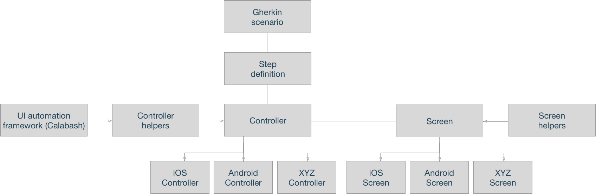

# Multiplatform Calabash

## Impetus

Frequently, companies develop native mobile applications for both iOS and Android alongside one another. Usually, parity of behaviour between apps is
 an important requirement. If I switch platforms I don't want to find that several features I relied on are no where to be seen!
 
The apps will not be identical however - there may be differing design principles between platforms. For example, say I want to see my saved locations within the app.
This may mean opening a burger menu on Android and tapping the Locations option, whereas there is a tab bar icon for the same purpose on iOS.

This project provides a framework for sharing as much test code between platforms as possible, allowing you to delegate behaviour only when you need to.

## Structure



## Explanation

Controller logic (i.e., navigation between screens, initiating the checks for elements, clicking buttons, etc) is defined in the base controller and inherited by all platform-specific controllers. Platform-specific controllers are optional, and should only be implemented if you need different functionality between platforms.

Screen queries (i.e. searching for the word 'Login' by text, or searching for an input field using id 'passcode_input') live inside the Screen files. Again, text between platforms should be pretty congruent, but you can optionally delegate to platform-specific screen files in the case of different queries. 

Because the implementation details of the Calabash framework is hidden away in the helpers, you can quite easily swap out Calabash for a different framework without affecting the scenarios, steps, controllers or screens. Make sure you put anything Calabash (or other framework) specific methods inside these helpers to maximise ease of transition to another or upgraded framework in the future.

For the gritty mixin and redefinition details, have a look inside [env.rb](calabash/features/support/env.rb)

## Usage

Explore the [Calabash folder](calabash). Hopefully the example [controllers](calabash/features/support/controller) and [screens](calabash/features/support/screen) are friendly enough for you to get the gist! 

Basic rules:

- Platform-specific controller class names must end with 'Android' or 'iOS'. Likewise for screen class names. 
- If you want a scenario only to run on the Android platform, tag it @android-only. Likewise for iOS, tag the scenario @ios-only.
- If you want to add more controller or query functionality, do so in the respective helpers. Keep automation framework specific code out of the controllers/screens!


#### Android

Open the [Android folder](android) in Android Studio and build it - or navigate to the folder in your terminal and run:

```bash
	gradle assembleDebug
```

Navigate to the [Calabash folder](calabash) in your terminal and run:

```bash
	bundle install
	bundle exec calabash-android run ~/path/to/generated/apk --profile android
```	

#### iOS

Open the [iOS folder](ios) in Xcode and build the Calabash target.

Navigate to the [Calabash folder](calabash) in your terminal and run:

```bash
	bundle install
	bundle exec cucumber --profile ios
```	